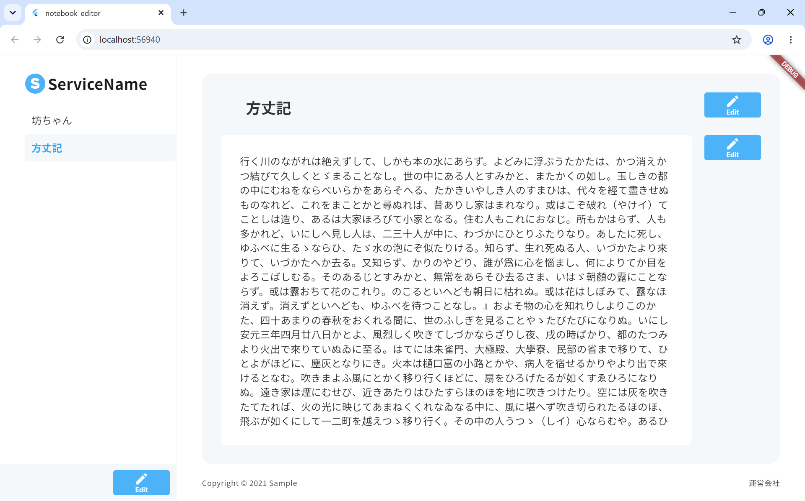
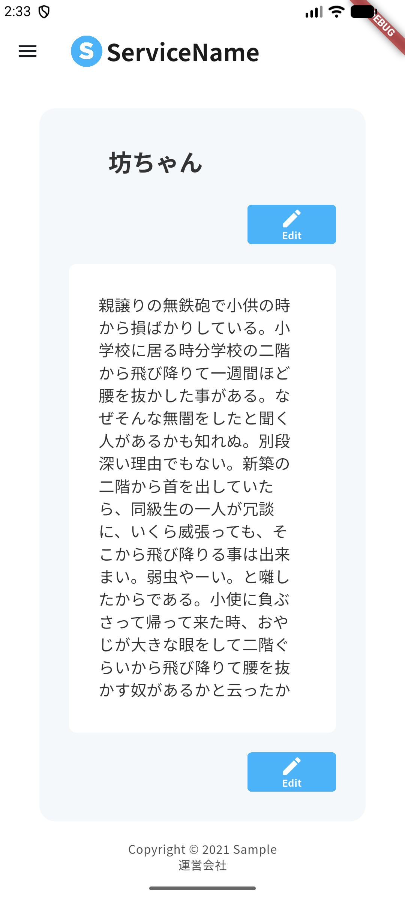

# notebook-editor

NCDC フロントエンド課題（Notion 風のページエディタ）を Flutter で実装したものです。

| PC（Chrome・横長） | Android（エミュレータ・縦長） |
|---|---|
|  |  |

---

## 動かし方

### 必要なもの

| | バージョン |
|---|---|
| [FVM](https://fvm.app/) | Flutter 3.47.3（`.fvmrc` で固定） |
| 実行先 | Chrome（推奨）または Android エミュレータ |

エミュレータの用意が要らず、セットアップが少ないため Chrome での実行を推奨します。

### 1. バックエンドを起動する

### 2. フロントエンドを起動する

```bash
fvm install
fvm flutter pub get

# Web（推奨）
fvm flutter run -d chrome --dart-define-from-file=.env.local.web

# Android エミュレータ
fvm flutter run --dart-define-from-file=.env.local.android
```

VS Code では `.vscode/launch.json` の「Web (Chrome)」「Android (emulator)」からも起動できます。

- 接続先は `--dart-define-from-file` で渡します。Android エミュレータからホストの `localhost` へは `10.0.2.2` で接続します
- Android の平文 HTTP の許可は `android/app/src/debug/AndroidManifest.xml` に置いており、debug ビルドにのみ適用されます
- 生成ファイル（`.freezed.dart` / `.g.dart`）はコミット済みのため、`build_runner` を実行する必要はありません
- Noto Sans JP を同梱しているため、Web の初回表示に時間がかかります

### テスト

```bash
fvm flutter test
```

---

## 機能

### 要件への対応

| 要件 | 実装 |
|---|---|
| サイドバーに全ページを表示する | `GET /content` の一覧を表示 |
| 「+」で新規ページを作成する | サイドバー下部の Edit でメニュー編集モードに入り、「+」で作成 |
| 「-」でページを削除する | メニュー編集モード中、各項目の右端に削除ボタンを表示 |
| タイトルと本文をそれぞれ編集・保存する | タイトルと本文で独立した編集モードを持ち、別々に保存 |
| タイトル 1〜50 文字 / 本文 10〜2000 文字 | 制約を満たさない間は Save を押せない（[バリデーション](#バリデーション)） |

### 追加した機能

- **レスポンシブ対応**: 画面が横長なら仕様どおりのレイアウト、縦長ならサイドバーを Drawer に収める
  - 仕様は PC 横長のみのため、縦長では余白とレイアウトを調整するアレンジを行った
    - メインエリアの左右の余白を PC の半分にした。PC の値のままでは本文が 1 行 15 文字ほどしか入らないため。上下の余白は詰めると読みにくくなるため PC と同じにしている
    - タイトル・本文の Edit / Save / Cancel ボタンを右ではなく下に置いた
    - フッターの「Copyright」と「運営会社」を左右ではなく中央に縦に並べた
- **サイドバーの項目に hover / 押下の表現**: 仕様に定義が無く、そのままでは Web でクリックできることが分からないため。色は仕様の背景色 2 色の範囲で表現し、新しい色は作っていない
- **長いタイトルの省略表示**: タイトルは最大 50 文字で、サイドバーの項目幅に収まらないため
- **通信失敗の表示**
  - 作成・保存・削除の失敗は SnackBar で知らせる。保存に失敗したときは入力を失わないよう編集モードのまま残す
  - 一覧の取得失敗は「取得に失敗しました」とテキストで表示する。縦長ではサイドバーが隠れるため、メインエリアにも表示する

### 既知の制約

ルーティングの見直しとあわせて対応する予定です。

- 選択中のページを URL に持たせていないため、リロードすると選択が外れる
- タイトル・本文の編集中に別のページを選ぶと、入力中の内容が破棄される
- 新規作成したページは自動で選択されない

---

## 設計

### 技術選定

| 項目 | 選択 | 理由 |
|---|---|---|
| フレームワーク | Flutter | モバイルエンジニアとして応募しているため |
| 状態管理 | Riverpod（`hooks_riverpod` + `riverpod_generator`） | 依存の解決とキャッシュを型安全に書けるため |
| HTTP | `http` | 必要なのは 5 エンドポイントのみで、`dio` のインターセプタ等を使う場面がないため |
| ルーティング | `go_router` + `go_router_builder` | パスとパラメータを型で扱うため |
| 動作確認環境 | Android（エミュレータ）、Web（Chrome） | デザイン仕様が PC 横長前提のため Web で確認し、モバイルエンジニアとして応募しているため Android でも確認した |

### レイヤ構成

```
UI (AsyncValue)
  ↑
Notifier / Provider      … Result を AsyncValue に変換し、一覧の状態を持つ
  ↑
Repository (Result<T>)   … エンドポイントと Content を知る。HTTP は知らない
  ↑
ApiClient (Result<T>)    … HTTP の作法だけを知る。Content は知らない
```

`ApiClient` は、baseUrl の一元化、204 / 空ボディの扱い、UTF-8 のデコード、例外から `AppError` への変換を受け持ちます。
**ここを通過したあとに `http.Response` や `statusCode` が漏れないこと**を、層を分ける条件にしています。

### エラー設計

- `sealed class AppError`（`NetworkError` / `NotFoundError` / `ServerError` / `ParseError` / `ValidationError`）
- `sealed class Result<T>`（`Ok` / `Err`）
- Repository までは `Result` を返し、エラーの処理し忘れを型で防ぐ。UI の手前で `AsyncValue` に載せ替える

**検討して捨てた案**: 全層で例外を投げ、`AsyncValue.guard` だけで扱う案。
記述量は減りますが、`AsyncValue.error` は `Object` 型なので、どのエラーを扱うべきかが型から分からなくなります。

### データフロー — 一覧を唯一の出典にする

`GET /content` が本文まで返すため、単体取得のリクエストは投げません。
選択中のページは一覧から導出する派生 Provider（`contentByIdProvider`）で取得します。

編集・削除が一覧に反映されれば詳細側にも自動で伝わるため、手動の `invalidate` が要らず、
同じ Content のコピーが 2 箇所でズレることも構造的に起きません。

### 状態の置き場所とコンポーネント分割

| | 責務 | 基底クラス |
|---|---|---|
| `presentation/screens/` | Provider を watch し、hooks で画面ローカルな状態を持つ | `HookConsumerWidget` |
| `presentation/components/` | 受け取った値を描画し、コールバックを呼ぶだけ | `StatelessWidget` |

- **状態を持つのは screen だけ**にしています。component は Provider を参照しないため、`ProviderScope` やモックなしで単体で描画・テストでき、どこにでも置けます
- **`StatefulWidget` は使いません。** コントローラの生成と破棄が 1 行にまとまり、`dispose` の書き漏れが起きないため hooks を採用しました
- サーバー由来のデータは Provider、選択中のページや編集モードかどうかは画面ローカルな状態（`useState`）に置いています

**受け入れたトレードオフ**: hooks の「build の先頭で毎回同じ順序で呼ぶ」という規約を検査する lint が Dart には無く、規約は人が守る前提になります。

### デザイントークン

色・寸法・テキストスタイルを `lib/core/theme/` に集約し、**ここ以外に色コードと px を書かない**ようにしています。
先に整備したのは、UI の実装を「決まったトークンを組み合わせる作業」にして、画面ごとに仕様書を見直す手間と値の取り違えを無くすためです。

トークンは**値ではなく用途で分けています。** たとえば `#B3B3B3` は `buttonNormal` / `secondaryPressed` / `scrollbar` の 3 つに分けています。
値の一致は偶然であって意味の一致ではないため、片方だけ変えたいときに他を巻き込まないようにしています。

色・寸法は、デザイン仕様の HTML に埋め込まれたレイヤーデータから取得しています（プレビュー画像からの目測ではありません）。

---

## 仕様の解釈

### バックエンドの制約と対応

バックエンドのソースを読んで確認した事実と、その対応です。

| 事実 | 対応 |
|---|---|
| サーバー側にバリデーションが無い（空文字でも 201） | 文字数の制約はすべてフロントで担保する |
| `PUT` は部分更新できない（title / body とも必須） | 最新の Content を保持し、常に両方を送る |
| レスポンスの `title` / `body` が nullable | パース時に空文字へ畳む |
| `DELETE` は 204 でボディが無い | ボディが空なら JSON をパースしない |
| 存在しない ID でも 404 を返さない | `ServerError` として扱う |
| 楽観ロックの仕組みが無い | 保存は明示的な Save のみ。後勝ちの上書きは受け入れる |

### バリデーション

**ルールの置き場所**: 制約は UI の都合ではなく課題が定めたドメインのルールなので、`lib/core/validation.dart` に定数と純粋関数として置き、唯一の出典にしています。
参照するのは UI（Save の活性）と Notifier（不正なリクエストを送らない保証）の 2 箇所です。

**モデルに制約を持たせない**: `Content` はサーバーが持つ状態の写しであり、妥当な状態を表すものではありません。
サーバーは制約を満たさない値（空のタイトル）を返しうるうえ、入力中は必ず不正な状態を経由するため、モデルが拒むと表示も編集も成立しません。

**不正な状態の見せ方**:

- 保存してよいかは Save ボタンの状態で表す。仕様に disabled 状態が定義されているため、仕様の範囲内で表現できる
- 上限は入力欄の `maxLength` で強制する
- エラーメッセージや文字数カウンタは出さない（実画面に存在しないため）

**受け入れたトレードオフ**:

- 入力欄の `maxLength` は見た目の 1 文字単位、Save の判定は UTF-16 単位で数えるため、絵文字では判定がズレる（絵文字 26〜50 個のタイトルは入力できるが Save できない）。ズレは常に「保存できない」側に倒れ、制約を超えた値が保存されることはない
- カウンタもメッセージも無いため、Save を押せない理由が画面から分からない

**検討して捨てた案**:

- **入力欄では制限せず、上限も Save の状態だけで表す案。** 判定は 1 箇所にまとまるが、2000 文字を超えて打ち込んでから保存できないと気づくことになる。入力の時点で止めるほうが良いと判断した
- **新規作成時にサーバーには作らず、ローカルの下書きを初回保存時に `POST` する案。** 作成直後にエラー状態にならないよう、有効な初期値（タイトル「無題」と 10 文字以上の本文）でサーバーに作る案を採った

---

## テスト

層を分けてあるため、ウィジェットを組み立てずに済む下の層から書いています。
いずれも、上の章で書いた設計判断が実際に成り立っていることを確かめるためのテストです。

| 対象 | 確認していること | 裏付ける判断 |
|---|---|---|
| `TitleValidation` / `BodyValidation` | 境界値。絵文字を UTF-16 単位で数えること | 文字数の制約をフロントで担保する。数え方の決定をテストで固定する（[バリデーション](#バリデーション)） |
| `NotebookApiClient` | 204 / 空ボディ、404、5xx、不正な JSON、通信例外がそれぞれ正しい `Result` になること。日本語のデコード | バックエンドの癖を吸収し、`http.Response` を外に漏らさない境界である（[レイヤ構成](#レイヤ構成)、[バックエンドの制約と対応](#バックエンドの制約と対応)） |
| `ContentsNotifier` | 作成・保存・削除のあと一覧と `contentByIdProvider` が追従すること。失敗時・検証で弾いたときに一覧が変わらないこと | 一覧を唯一の出典にすれば、詳細側は手動の `invalidate` なしで追従する（[データフロー](#データフロー--一覧を唯一の出典にする)） |

- モックは `package:http/testing.dart` の `MockClient` で **HTTP の境界**に置いています。Repository をモックにすると、JSON から `Content` への変換（`null` を空文字に畳むなど）が検証されなくなるためです
- 画面全体のウィジェットテストやゴールデンテストは書いておらず、実際のバックエンドに繋いだ手動の確認で代えています。
  テスト環境の既定フォントでは画面のレイアウトがあふれて失敗するため、フォントの読み込みなどの回避策が要り、その手間に対して得られる信頼性が見合わないと判断しました

---

## 開発について

### AI との分業

開発には AI（Claude Code）を併用しました。

- **自分で判断した領域**: 層の分け方、コンポーネントの分割、状態の置き場所、仕様の食い違いへの判断、どの案を捨てるか
- **AI に任せた領域**: 決めた構造に沿ったコードの記述、デザイン仕様の値の転記、レビュー
- **テスト**: 観点とモックの置き場所は AI の提案です。自分で必要と考えていた観点がおおむね含まれていることを確認したうえで、網羅性を優先して採用しました

AI が関わったコミットには `Co-Authored-By` を付けています。

### 生成ファイルをコミットしている理由

`.freezed.dart` / `.g.dart` は一般には `.gitignore` に入れることが多いですが、意図的にコミットしています。
クローン後に `build_runner` を実行しないと、原因の分かりにくいコンパイルエラーで起動できないためです。
一人で開発する提出用リポジトリなので、差分の肥大やマージ競合といったデメリットは生じません。

### `.env.local.*` をコミットしている理由

接続先のホスト名とポートだけを持ち、秘密情報を含みません。
これが無いと起動できないため、`.gitignore` の `**/.env.*` に対して例外を設定しています。

---

## リソースとライセンス

- `assets/icons/` の SVG は、NCDC 提供の課題リソース（`Design/img/icon/`）です
- `assets/fonts/` の Noto Sans JP は SIL Open Font License で配布されており、ライセンス全文を `assets/fonts/OFL.txt` に同梱しています
